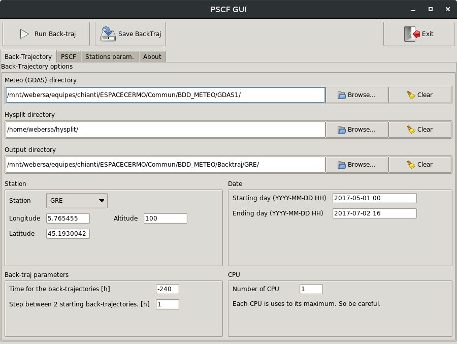
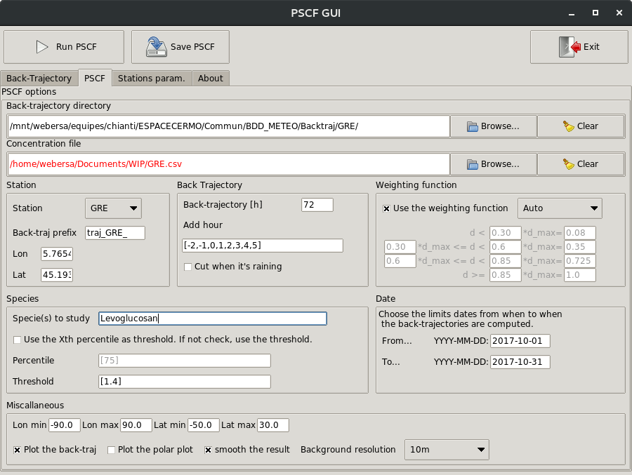
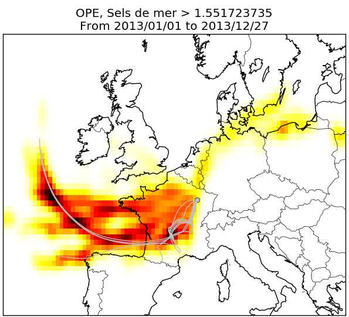

# pyPSCF
The Potential Source Contribution Function is a tool to investigate the sources
of chemical species in the atmosphere.

See the UserGuide for detailed information.

# Compute large number of backtrajectories

Under the hood [hysplit](https://ready.arl.noaa.gov/HYSPLIT.php) is used to
compute backtrajectories. This GUI allow you to compute easily large number of
backtrajectories given a starting date and a end date.

# Compute PSCF 

## Select parameters 

The second tab of the GUI are the PSCF parameters.

## Output

A figure will show up with the PSCF in colorscale. You can clic on a gridcell to
see all the backtrajectories that pass through this gridcell.

# Contribution

This GUI is an adapted GUI from the game "The Battle For Westnoth", developed by
Elvish_Hunter, 2014-2015, under the GNU GPL v2 license.

Original PSCF script: Jean-Eudes PETIT 

New PSCF script and GUI tools : Samuel WEBER

Icons are taken from the Tango Desktop Project (http://tango.freedesktop.org)
and are released in the Public Domain.
